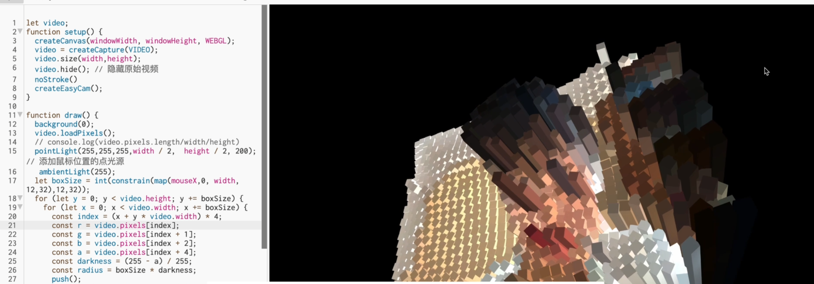
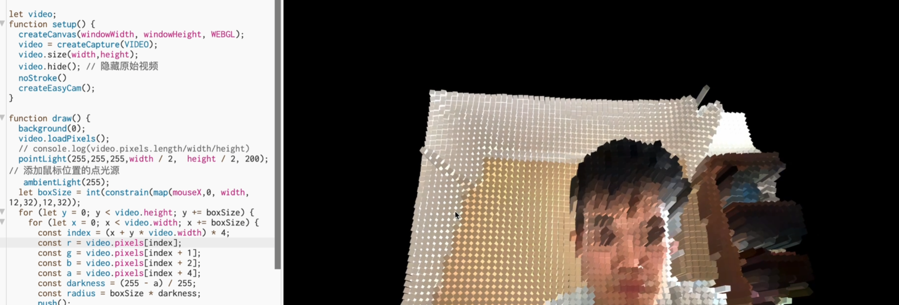
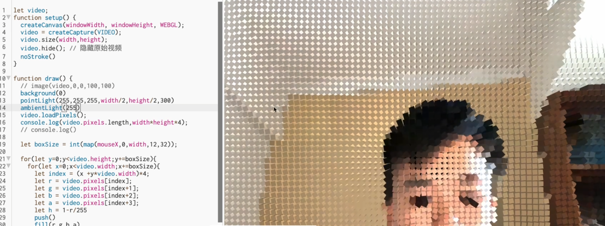
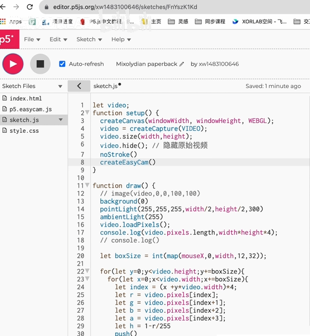

# yliu0027_9103_tut7
group project
This is a first project!
# Quiz 8: Imaging and Coding Technique Inspiration

## Part 1: Imaging Technique Inspiration

### Chosen example: P5.js webcam-based pixel block 3D visual system

The imaging technique I find inspiring is the real-time webcam interaction and pixel-block 3D visual style shown in this P5.js tutorial video. I would like to incorporate the idea of transforming live camera input into abstract visual blocks. This technique is useful because it turns the viewer’s body or movement into part of the artwork. It also fits the assignment requirements because it supports interaction, animation and creative image manipulation. Even if the full 3D system is difficult to implement, the pixelated visual effect is a strong inspiration for my project.

### Inspiration images

Video source:  
[[P5.js Tutorial] 13. Real-time video interaction via the camera: a pixel-block-style 3D system](https://www.bilibili.com/video/BV1eX4y1W7oZ/)

---

## Part 2: Coding Technique Exploration

### Coding technique: p5.js createCapture() and pixel manipulation

A useful coding technique for this effect is using p5.js `createCapture(VIDEO)` with pixel manipulation. The webcam image can be captured in real time, then divided into small pixel blocks. Each block can use colour or brightness data from the video to control its size, position or depth. This can help create an interactive artwork where the user’s movement changes the visual output. It could also be extended into a 3D-looking system by drawing blocks or shapes based on brightness values.

### Coding technique image

### Example implementation

- [p5.js Video Capture example](https://p5js.org/examples/imported-media-video-capture/)
- [p5.js createCapture() reference](https://p5js.org/reference/p5/createCapture/)
- [The Coding Train: Pixels with p5.js](https://thecodingtrain.com/pixels)
- [Pixelated video example in p5.js Web Editor](https://editor.p5js.org/enickles/sketches/gixDC77Ql)